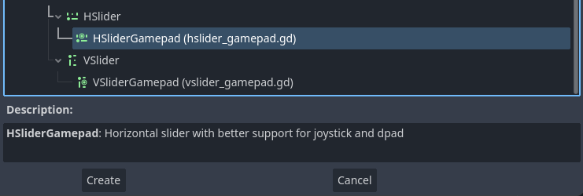
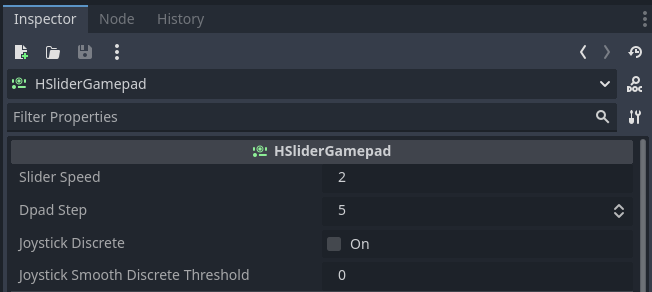

# SliderGamepad

Custom nodes to have better joystick and dpad support on sliders.

## Features

- Smooth joystick: hold the joystick in one direction and the slider value adjust smoothly
- Discrete joystick: the joystick acts as a button, only updating the value by one each "press"
- Smooth & discrete: joystick is in discrete mode, until you hold the direction for more than a threshold time when it switches to smooth
- Dpad steps: dpad can modify the value configurable steps instead of the default 1 step

## How to use

The addon assumes you have the joypad mapped to the default ui actions: **ui_left**, **ui_right**, **ui_up**, **ui_down**
The dpad discrete function reacts directly to the **InputEventJoypadButton**

**Step 1: Add a HSliderGamepad or VSliderGamepad**

Add a node as you normally do and choose either HSliderGamepad or VSliderGamepad depending on your needs

**Step 2: Setup the node**

- **Slider speed**: the speed at which the value is changed (per frame)
- **Dpad step**: the step size when using the dpad 
- **Joystick discrete**: sets the joystick in discrete mode
- **Joystick smooth discrete threshold**: time in seconds after which the joystick will switch to smooth when held in one direction (requires joystick to be set to discrete mode)

## 💁‍♂️ About me

Software engineer & gamedev. 3D, 2D & VR. 

- [Discord](https://discord.gg/83nFRPTP6t)
- [YouTube - Gamedev](https://www.youtube.com/c/MrEliptik)
- [YouTube - Godot related](https://www.youtube.com/@mrelipteach)
- [Twitter](https://twitter.com/mreliptik)
- [Instagram](https://www.instagram.com/mreliptik)
- [Itch.io](https://mreliptik.itch.io/)
- [All links](https://bento.me/mreliptik)

## 📔 LICENSE

This project is distributed under the MIT license, which it's free to use, modify and redistribute, for both personal and commercial projects. For more information see [LICENSE.md](LICENSE).